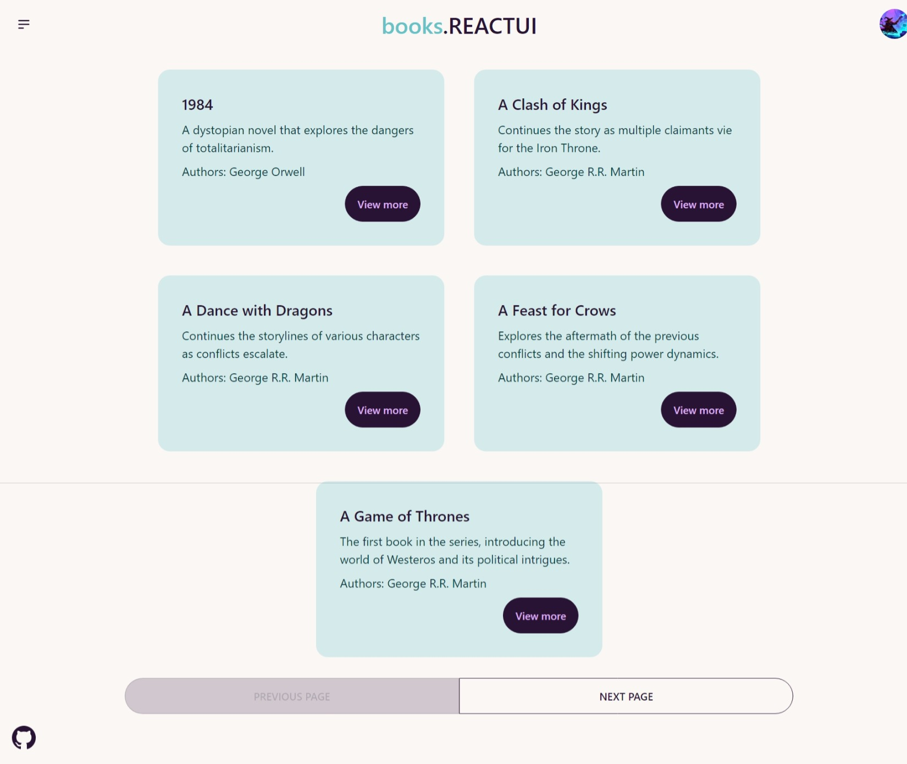
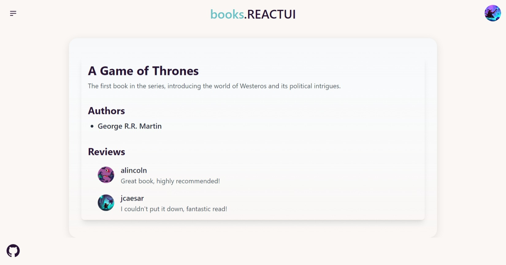
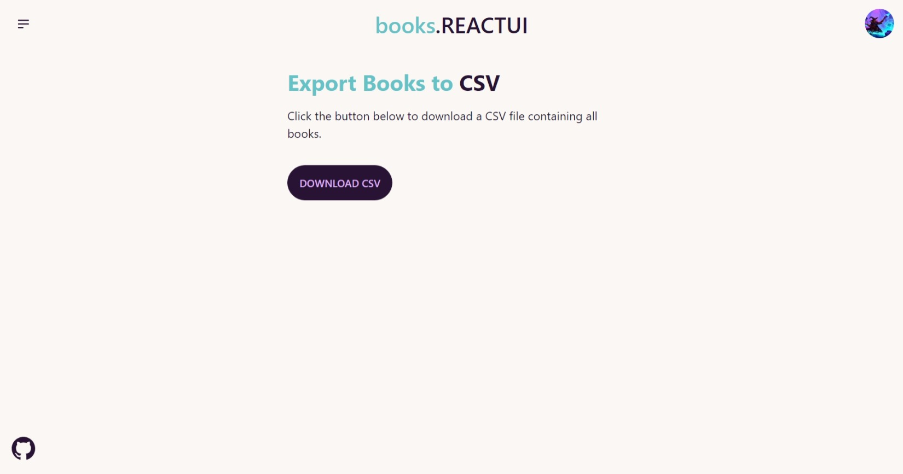

A sample implementation demonstrating the implementation of Domain-Driven Design (DDD), Clean Architecture, and Command Query Responsibility Segregation (CQRS) in an ASP.NET Web API utlizing the MediatR library for command and query handling and EF Core for data access.

## Getting Started

```powershell
cd scripts
.\add-migrations.ps1 -Name MigrationName
.\update-database.ps1
.\run.ps1 [-RunBlazorWasm] [-RunExternalServices] [-RunReact]
```

## Project Structure

The project follows a modular structure based on the principles of Clean Architecture, promoting separation of concerns and maintainability.

```
├── Application
│   ├── Books
│   │   ├── Commands
│   │   └── Queries
│   │   └── Events
│   └── Authentication
│       ├── Commands
│       └── Queries
├── Domain
│   ├── BookAggregate
│   │   ├── Entities
│   │   └── ValueObjects
│   │   └── Events
│   └── UserAggregate
│   │   ├── Entities
│   │   └── ValueObjects
├── Infrastructure
│   ├── Persistence
│   │   ├── Configurations
│   │   └── Repositories
│   │   └── Interceptors
│   ├── Services
│   └── Authentication
├── Presentation
│   ├── Controllers
│   ├── Filters
│   ├── Middlewares
│   └── Mappings
└── Shared
    └── Errors
        ├── General
        └── Authentication
```

- **Application**: Contains the implementation of application-specific logic, including command and query handlers.

  - **Commands**: Holds the command handlers responsible for handling application commands.
  - **Queries**: Contains the query handlers responsible for handling application queries.
  - **Events**: Contains the event handlers responsible for reacting to domain events.
  - **Contracts**: Defines contracts and interfaces used across the application.

- **Domain**: Represents the core domain model and business logic of the application.

  - **UserAggregate**: Handles domain logic related to users.
  - **BookAggregate**: Handles domain logic related to books.
    - **Entities**: Defines the domain entities and their behaviors.
    - **Events**: Defines domain events specific to the book aggregate.
    - **ValueObjects**: Contains value objects used within the domain
  - **Common**: Contains common domain elements such as interfaces, base classes, or utility classes.

- **Infrastructure**: Provides implementation details and infrastructure concerns.

  - **Persistence**: Includes data access-related components, such as migrations, repositories and configurations.
    - **Repositories**: Implements repositories for data access and persistence.
    - **Configurations**: Defines entity configurations for mapping domain entities to database tables.
    - **Interceptors**: Contains interceptors for intercepting and modifying data access operations.
  - **Services**: Implements various services used by the project.
  - **Authentication**: Handles authentication-related infrastructure concerns.

- **Presentation**: Handles the web presentation layer(API) of the application.

  - **Controllers**: Defines API controllers that handle incoming HTTP requests.
  - **Filters**: Contains custom filters that can be applied to the API controllers or specific actions
  - **Middlewares**: Includes custom middlewares for exception handling
  - **Mappings**: Provides mapping configurations using AutoMapper

- **Shared**: Contains shared components and utilities used across the project.
  - **Errors**: Provides error handling utilities.
    - **General**: Contains general-purpose error handling components.
    - **Authentication**: Includes error handling components specific to authentication.

## Dependencies

This project utilizes the following libraries and packages:

- [MediatR](https://github.com/jbogard/MediatR): A library for implementing the Mediator pattern in application command and query handling.
- [Entity Framework Core](https://github.com/dotnet/efcore): An ORM (Object-Relational Mapping) framework for data access.
- [FluentValidation](https://github.com/FluentValidation/FluentValidation): A library for implementing validation rules and logic.
- [AutoMapper](https://github.com/AutoMapper/AutoMapper): A library for object-to-object mapping.
- [CSharpFunctionalExtensions](https://github.com/vkhorikov/CSharpFunctionalExtensions): A library that provides functional programming concepts to C#.
- [CsvHelper](https://github.com/JoshClose/CsvHelper): A library for reading and writing CSV files.

## Client: ReactUI

<p align="center">
  
  <br>
  <em>Home Page: List of Books</em>
</p>

<p align="center">
  
  <br>
  <em>Details Page: View detailed information about a book with comments from other users</em>
</p>

<p align="center">
  
  <br>
  <em>Profile Page: User's profile page</em>
</p>

<p align="center">
  
  <br>
  <em>Export Page: Export data in CSV format</em>
</p>

---
